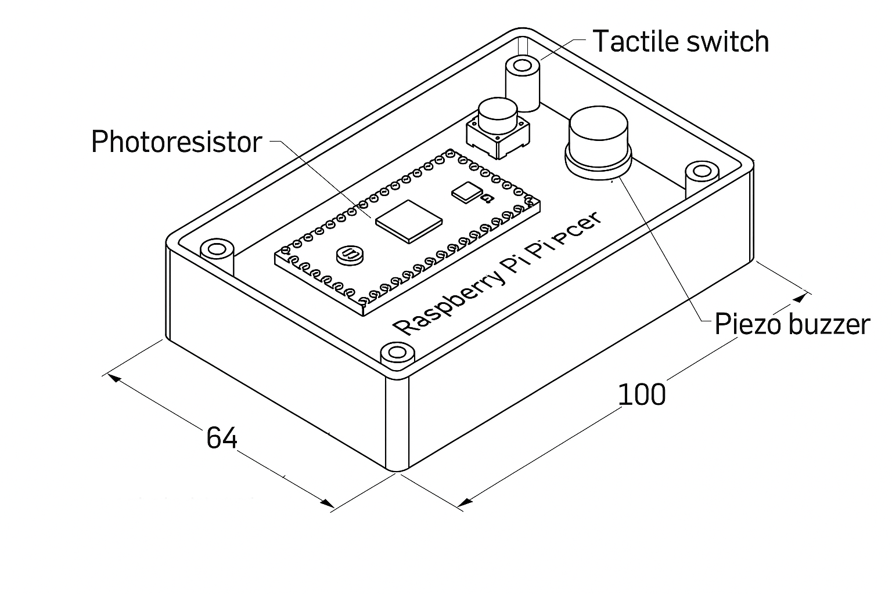
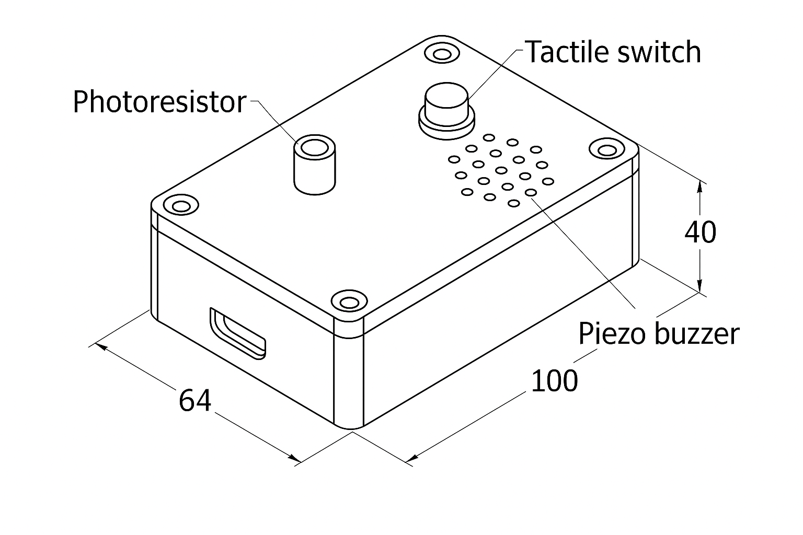

# Housing Unit Design

The housing unit protects the Raspberry Pi Pico W and peripherals while making them accessible for interaction. The design prioritizes **child safety, durability, and usability**.

---

### Internal Layout  

This diagram shows the **internal layout** of the housing unit. Key features include:  
- **Raspberry Pi Pico W** securely mounted on standoffs.  
- **Photoresistor** positioned for ambient light measurement.  
- **Tactile switch** for user interaction.  
- **Piezo buzzer** mounted on the top for sound output.  
- Internal dimensions: **100 mm (L) × 64 mm (W) × 40 mm (H)**.

---

### External Lid & Safe Mounting  
  

This diagram shows the **external view of the top lid** with user-facing features:  
- **Grille** for the piezo buzzer to allow sound output.  
- **Photoresistor opening** with recessed or light-pipe protection to ensure safety for children.  
- **Tactile switch** accessible from the top surface.  
- **USB cutout** for powering and programming the Pico W.  
- Four **corner screw holes** for securely fastening the lid to the base.

---

### Design Considerations
- **Safety**: All edges are rounded, and the photoresistor is recessed/light-piped to prevent snapping or exposure.  
- **Durability**: 2 mm wall thickness provides strength while keeping weight low.  
- **Educational Use**: Clear visibility and intuitive placement of components encourage hands-on STEM learning.  
